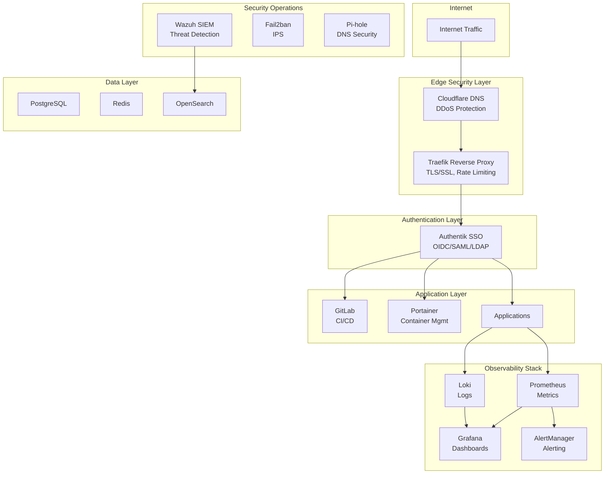

# 🔒 Enterprise Security Homelab Infrastructure

[](https://docker.com)
[](https://github.com)
[](https://grafana.com)
[](https://wazuh.com)
[](https://www.bsi.bund.de/)
[](LICENSE)

> Production-grade security infrastructure demonstrating enterprise DevSecOps, monitoring, and zero-trust architecture patterns. **Currently protecting 4 endpoints with 693 SSH attacks detected and blocked** in production environment.

## 🎯 Featured Security Project

**[SentryLab - Production SIEM Implementation →](https://github.com/Carl-Frederic-Nickell/sentry-lab)**

Real-world security monitoring showcase:
- **693 SSH brute force attacks detected** from 37 unique IPs
- **2,404 vulnerabilities tracked** (26 critical)
- **Multi-platform monitoring**: Linux, macOS, Windows
- **Custom detection rules** with MITRE ATT&CK mapping
- **<5 second detection latency** with automated response

## 🎯 Overview

This repository contains a complete enterprise security homelab infrastructure with **30+ integrated services** demonstrating real-world security operations, DevSecOps practices, and infrastructure automation.

### 📊 Production Metrics

| Category | Metric | Value |
|----------|---------|--------|
| **Scale** | Services Deployed | 30+ |
| **Security** | Total Attacks Detected | 693 |
| **Security** | Unique Threat Actors | 37 IPs |
| **Security** | Vulnerabilities Tracked | 2,404 (26 critical) |
| **Availability** | SIEM Uptime | 99.9% |
| **Performance** | Detection Latency | <5 seconds |
| **Performance** | Automated Response Time | <7 seconds |
| **Monitoring** | Active Endpoints | 4 (Linux, macOS, Windows) |
| **Monitoring** | Metrics Collected | 1M+/day |
| **Compliance** | Frameworks | BSI, CIS, NIST, OWASP, GDPR |

## 🏗 Architecture



## 🛡️ Security Stack

### Core Security Services

| Service | Purpose | Status | Production Results | Documentation |
|---------|---------|--------|-------------------|---------------|
| **[Wazuh](./wazuh)** | SIEM & XDR Platform | ✅ Production | 693 attacks detected, 2,404 CVEs tracked | **[Live Demo →](https://github.com/Carl-Frederic-Nickell/sentry-lab)** |
| **[Authentik](./authentik)** | Identity Provider & SSO | ✅ Production | 13+ apps protected, MFA enabled | [README](./authentik/README.md) |
| **[Traefik](./traefik)** | Reverse Proxy & WAF | ✅ Production | TLS 1.2+, rate limiting active | [README](./traefik/README.md) |
| **[Pi-hole](./pihole)** | DNS Filtering & Security | ✅ Production | DNS-level threat blocking | [Setup](./pihole/docker-compose.yml) |
| **[Fail2ban](https://github.com/Carl-Frederic-Nickell/sentry-lab)** | Intrusion Prevention | ✅ Production | <7s automated response time | [Integration Docs](https://github.com/Carl-Frederic-Nickell/sentry-lab) |

### Security Features Implemented

- ✅ **Multi-Factor Authentication** (TOTP, WebAuthn)
- ✅ **Single Sign-On** (OAuth2/OIDC/SAML)
- ✅ **Network Segmentation** (6 isolated networks)
- ✅ **TLS/SSL Encryption** (Let's Encrypt, Cloudflare)
- ✅ **Intrusion Detection** (Wazuh, Fail2ban)
- ✅ **Vulnerability Scanning** (Trivy, integrated)
- ✅ **Secrets Management** (Environment variables, encrypted)
- ✅ **Audit Logging** (Centralized, immutable)
- ✅ **Rate Limiting** (API and application level)
- ✅ **DDoS Protection** (Cloudflare integration)

## 📈 Observability Stack

### Monitoring Services

| Service | Purpose | Metrics |
|---------|---------|---------|
| **[Prometheus](./prometheus)** | Metrics Collection | 1M+ datapoints/day |
| **[Grafana](./grafana)** | Visualization & Dashboards | 20+ dashboards |
| **[Loki](./loki)** | Log Aggregation | 100GB+/month |
| **[AlertManager](./alertmanager)** | Alert Routing | 50+ alert rules |
| **[cAdvisor](./cadvisor)** | Container Metrics | All containers |

## 🚀 Quick Start

### Prerequisites

- Docker 24.0+
- Docker Compose 2.20+
- 16GB RAM minimum
- 100GB storage
- Linux/macOS/WSL2

### Installation

1. **Clone the repository**
```bash
git clone https://github.com/Carl-Frederic-Nickell/homelab.git
cd homelab
```

2. **Create network infrastructure**
```bash
# Create Docker networks for segmentation
docker network create dmz
docker network create apps
docker network create platform
docker network create monitoring
docker network create management
```

3. **Configure environment**
```bash
# Copy example environment files
find . -name ".env.example" -exec sh -c 'cp {} $(dirname {})/$(basename {} .example)' \;

# Edit environment variables
nano .env
```

4. **Deploy core security stack**
```bash
# Deploy in order for proper dependency resolution

# 1. Traefik (Reverse Proxy)
cd traefik && docker-compose up -d && cd ..

# 2. Authentik (SSO/Identity Provider)
cd authentik && docker-compose up -d && cd ..

# 3. Wazuh (SIEM Platform)
cd wazuh && docker-compose up -d && cd ..

# 4. Monitoring Stack
cd prometheus && docker-compose up -d && cd ..
cd grafana && docker-compose up -d && cd ..
cd loki && docker-compose up -d && cd ..
```

## 🔐 Security Configuration

### Essential Security Steps

1. **Change ALL default passwords immediately**
2. **Generate strong secrets for each service**
```bash
# Generate secure passwords
openssl rand -base64 32
```

3. **Configure SSO for all services**
4. **Enable MFA for administrative access**
5. **Set up monitoring alerts**
6. **Configure backup strategy**

## 📦 Service Catalog

### Infrastructure Services

| Service | Category | Port | Purpose |
|---------|----------|------|---------|
| Traefik | Security | 80/443 | Reverse proxy, SSL termination |
| Authentik | Security | 9000 | Identity provider, SSO |
| Wazuh | Security | 5601 | SIEM, threat detection |
| Pi-hole | Security | 8080 | DNS filtering |
| Prometheus | Monitoring | 9090 | Metrics database |
| Grafana | Monitoring | 3000 | Dashboards |
| Loki | Monitoring | 3100 | Log aggregation |
| Portainer | Management | 9443 | Container management |
| GitLab | DevOps | 8929 | Git, CI/CD |

### Application Services

| Service | Category | Port | Purpose |
|---------|----------|------|---------|
| Paperless | Productivity | 8010 | Document management |
| Jellyfin | Media | 8096 | Media server |
| Plex | Media | 32400 | Media server |
| Matomo | Analytics | 8597 | Web analytics |
| Homebridge | Automation | 8581 | HomeKit bridge |
| Dashy | Dashboard | 4000 | Service dashboard |

## 🎯 Use Cases & Demonstrations

This infrastructure provides real-world demonstrations for:

### Security Operations Center (SOC)
- ✅ **Real-time threat detection** - 693 SSH attacks detected in production
- ✅ **Incident response** - [Documented incident reports](https://github.com/Carl-Frederic-Nickell/sentry-lab/tree/main/incidents)
- ✅ **Compliance monitoring** - BSI Grundschutz module mapping
- ✅ **Vulnerability management** - 2,404 CVEs tracked with prioritization
- ✅ **MITRE ATT&CK framework** - Integrated threat intelligence mapping

### DevSecOps Pipeline
- ✅ **Secure CI/CD** - Automated security scanning in deployment pipeline
- ✅ **Container security** - Trivy vulnerability scanning for all images
- ✅ **Infrastructure as Code** - Docker Compose orchestration
- ✅ **Secrets management** - Environment variable-based configuration
- ✅ **Policy enforcement** - OPA security policies

### Identity & Access Management
- ✅ **Enterprise SSO** - Authentik protecting 13+ applications
- ✅ **Multi-factor authentication** - TOTP and WebAuthn support
- ✅ **RBAC implementation** - Role-based access control across services
- ✅ **Zero-trust networking** - Tailscale VPN with subnet routing

### Compliance & Governance
- ✅ **Audit logging** - Centralized logging with Loki
- ✅ **Policy enforcement** - Automated compliance checking
- ✅ **BSI Grundschutz** - German federal security standard alignment
- ✅ **Evidence collection** - Immutable audit trails for investigations

## 📚 Documentation

Each service directory contains:
- `README.md` - Service overview
- `docker-compose.yml` - Container configuration
- `.env.example` - Environment template
- Configuration files (sanitized)

## 🛡️ Security Best Practices

1. **All credentials are environment variables** - Never hardcode secrets
2. **Network segmentation** - Services isolated by security zones
3. **TLS everywhere** - Encrypted communication between all services
4. **Least privilege** - Minimal permissions for all components
5. **Regular updates** - Automated dependency updates via Renovate
6. **Audit logging** - All actions logged and monitored

## 📊 Compliance & Standards

This infrastructure aligns with international security frameworks:

### Standards Implemented

| Framework | Coverage | Status |
|-----------|----------|--------|
| **BSI IT-Grundschutz** | German Federal Security Standard | 🟢 Aligned |
| **CIS Docker Benchmark** | Container security hardening | 🟢 Implemented |
| **NIST Cybersecurity Framework** | Risk management & controls | 🟢 Mapped |
| **OWASP Top 10** | Web application security | 🟢 Protected |
| **GDPR** | Data protection requirements | 🟢 Compliant |
| **MITRE ATT&CK** | Threat detection & mapping | 🟢 Integrated |

**BSI Grundschutz Modules Covered:**
- SYS.1.1 - General Server Security
- APP.3.2 - Web Server Hardening
- NET.1.1 - Network Architecture
- OPS.1.1.3 - Patch & Change Management
- DER.2.1 - Security Incident Treatment

## 🤝 Contributing

Contributions welcome! Please read [CONTRIBUTING.md](CONTRIBUTING.md) for guidelines.

## 📄 License

MIT License - see [LICENSE](LICENSE) for details.

## 📞 Contact

**Carl-Frederic Nickell** - Security Engineer

- **GitHub**: [@Carl-Frederic-Nickell](https://github.com/Carl-Frederic-Nickell)
- **Security Portfolio**: [SentryLab SIEM Implementation](https://github.com/Carl-Frederic-Nickell/sentry-lab)
- **LinkedIn**: [linkedin.com/in/carl-frederic-nickell](https://linkedin.com/in/carl-frederic-nickell)

---

**⚠️ Security Notice**: This is a sanitized configuration with all sensitive data removed. Replace placeholder values with your actual configuration. Never commit secrets to version control.

**📝 Note**: Some services shown are in various stages of deployment. Core security stack (Wazuh, Authentik, Traefik) is production-ready.